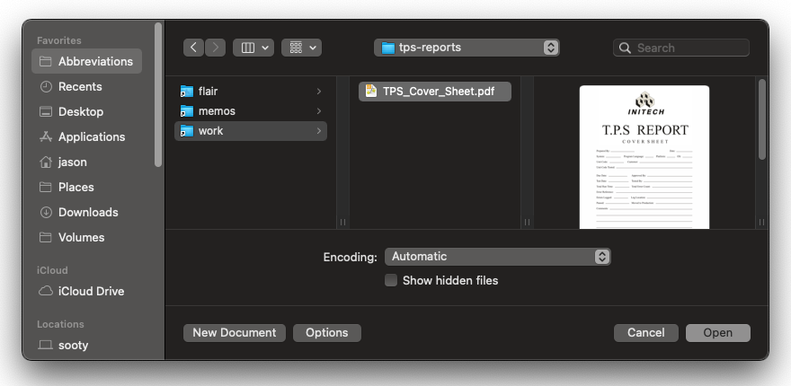

# Namelink zsh plugin

Namelink manages sets of named directories and keeps them synchronized. One of the main use cases is to manage the zsh named directory hash to facilitate a shared namespace between the `~foo` syntax and external processes like an editor or file manager. This is optional, but enabled by default.

It works by mapping sets of symbol-path pairs, which consist of associative arrays and/or directories, to likewise sets of output pairs. When the output is a directory, it is managed as a set of symbolic links. By default, the zsh named directory hash is configured as an output associative array, along with the `~/.@` directory.

In order to maximize speed, keep inodes consistent, and minimize churn, namelink strives to minimize reads and writes to the filesystem as much as possible.

## Directory locations

Location inputs can also be specified by calling the `namelink load` and `namelink unload` convenience functions. These functions manage the contents of the `namelink` variable (which is included in the set of inputs by default).

## Caveats

Output directories should be considered _fully managed_ by namelink. **Namelink will destructively alter the contents of output directories.**

Take care when linking across filesystems that may not always be accessible, such as network volumes. It has the potential to **slow down or hang the shell** if the cache needs rebuilding. To prevent this occurring, the author recommends containing such links inside a subdirectory which is not directly managed by namelink.

## Configuration

Namelink may be configured by the `namelink setopt` command. For example, to output symbolic links to a folder on the desktop, and disable management of the zsh named directory hash:

```console
% namelink setopt outputs dir:~/Desktop/Namelink\ Shortcuts
% 
```

To search only the `namelink` variable as input, and not the `~/.namelink` directory:
```console
% namelink setopt inputs var:namelink
% 
```

### List of configuration variables

| Name | Type | Description | Default |
| --- | --- | --- | --- |
| `verbose` | integer | `0` is off, increasing number means more verbosity | `0` |
| `inputs` | string array | the inputs to synchronize from | `( var:namelink dir:~/.namelinks )` |
| `outputs` | string array | the outputs to synchronize to | `( var:nameddirs dir:~/.@ )` |
| `precmd_enable` | boolean | enable `precmd` hook logic | `1` |
| `preexec_enable` | boolean | enable `preexec` hook logic | `1` |
| `stat_dirs` | boolean | observe changes in directory modification times in `precmd` and `preexec` hooks | `1` |
| `always_sync` | boolean | always call `namelink sync` immediately after performing an operation that changes state | `0` |


## Tutorial

In this tutorial, we will explore the process of abbreviating `/usr/local` and associated subdirectories.

First, let's create the default input and output directories for namelink to use:
```console
% mkdir ~/.namelinks ~/.@
% 
```

By default, namelink operates quietly, unless something goes wrong. Let's turn on verbose logging, so we can easily see what namelink is up to:
```console
% namelink setopt verbose 1
% 
```

Now we are ready to load some mappings. The file `tutorial.namelink` contains:
```
# namelink tutorial example
ul   /usr/local
ulb  ~ul/bin
uls  ~ul/sbin
ulv  ~ul/var
```

Let's load it:
```console
% namelink load < tutorial.namelink
namelink_sync: rebuilding cache
namelink_sync_output_dir: ~/.@: CREATE: ulb -> /usr/local/bin
namelink_sync_output_dir: ~/.@: CREATE: uls -> /usr/local/sbin
namelink_sync_output_dir: ~/.@: CREATE: ulv -> /usr/local/var
namelink_sync_output_dir: ~/.@: CREATE: ul -> /usr/local
% namelink show
ul /usr/local
ulb ~ul/bin
uls ~ul/sbin
ulv ~ul/var
% 
```

These mappings are now available, both in the named directory hash, and as symbolic links in the output directory.
```console
% echo ~uls
/usr/local/sbin
% realpath ~/.@/uls
/usr/local/sbin
% 
```

`namelink load` supports glob substitution syntax internally. However, if we try to use that syntax directly on the command line, without escaping the `~`, it will be statically expanded before namelink sees it:
```
% namelink load uli ~ul/include
namelink_sync: rebuilding cache
namelink_sync_output_dir: ~/.@: CREATE: uli -> /usr/local/include
% namelink show
ul /usr/local
ulb ~ul/bin
uli /usr/local/include
uls ~ul/sbin
ulv ~ul/var
%
```

If we escape the `~`, however, then namelink will substitute the value when synchronizing:
```
% namelink load ule \~ul/etc
namelink_sync: rebuilding cache
namelink_sync_output_dir: ~/.@: CREATE: ule -> /usr/local/etc
% namelink show
ul /usr/local
ulb ~ul/bin
ule ~ul/etc
uli /usr/local/include
uls ~ul/sbin
ulv ~ul/var
%
```

Namelink also reads any configured input directories to load mappings:
```console
% ln -s ~ul/lib ~/.namelinks/ull
namelink_stat_dirs: mtime trigger on input dir ~/.namelinks
namelink_sync_input_dir: loading input path: ~/.namelinks
namelink_sync: rebuilding cache
namelink_sync_output_dir: ~/.@: CREATE: ull -> /usr/local/lib
% namelink show
ul /usr/local
ulb ~ul/bin
ule ~ul/etc
uli /usr/local/include
ull /usr/local/lib
uls ~ul/sbin
ulv ~ul/var
% 
```

This mapping is now available in the same manner as before:
```console
% echo ~ull
/usr/local/lib
% realpath ~/.@/ull
/usr/local/lib
% 
```

Namelink attempts to keep the output directory synchronized, too. Let's try deleting a file there:
```console
% rm ~/.@/ull
namelink_stat_dirs: mtime trigger on output dir ~/.@
namelink_sync: rebuilding cache
namelink_sync_output_dir: ~/.@: CREATE: ull -> /usr/local/lib
% 
```
The damage is repaired.

If we actually want to remove the `ull` mapping, we can simply remove it from the input directory:
```console
% rm ~/.namelinks/ull
namelink_stat_dirs: mtime trigger on input dir ~/.namelinks
namelink_sync_input_dir: loading input path: ~/.namelinks
namelink_sync: rebuilding cache
namelink_sync_output_dir: ~/.@: DELETE: ull
% 
```

Recall we can make changes programmatically, too. Let's redefine `uls` to point to `/usr/local/share` instead of `/usr/local/sbin`:
```console
% namelink load uls \~ul/share
namelink_sync: rebuilding cache
namelink_sync_output_dir: ~/.@: UPDATE: uls -> /usr/local/share
% namelink show
ul /usr/local
ulb ~ul/bin
ule ~ul/etc
uli /usr/local/include
uls ~ul/share
ulv ~ul/var
% echo ~uls
/usr/local/share
% realpath ~/.@/uls
/usr/local/share
% 
```

And to remove a mapping:
```console
% namelink unload ulb
namelink_sync: rebuilding cache
namelink_sync_output_dir: ~/.@: DELETE: ulb
% namelink show
ul /usr/local
ule ~ul/etc
uli /usr/local/include
uls ~ul/share
ulv ~ul/var
% echo ~ulb
zsh: no such user or named directory: ulb
% 
```

That static `uli` definition is bugging me. Let's fix it:
```console
% namelink load uli \~ul/include
namelink_sync: rebuilding cache
% namelink show
ul /usr/local
ule ~ul/etc
uli ~ul/include
uls ~ul/share
ulv ~ul/var
% 
```
That's better.

We can also pass in the original mapping file to `namelink unload`, and namelink will ignore the destination paths therein. When removing entries, namelink will automatically resolve any dangling references.
```console
% namelink unload < tutorial.namelink
namelink_sync: rebuilding cache
namelink_sync_output_dir: ~/.@: DELETE: ul
namelink_sync_output_dir: ~/.@: DELETE: uls
namelink_sync_output_dir: ~/.@: DELETE: ulv
% namelink show
ule /usr/local/etc
uli /usr/local/include
%
```
(The `ulb` mapping wasn't removed here, because we already removed it earlier.)

Finally, to unload everything that is still loaded, we can pass `-a` to `namelink unload`:
```console
% namelink unload -a
namelink_sync: rebuilding cache
namelink_sync_output_dir: ~/.@: DELETE: ule
namelink_sync_output_dir: ~/.@: DELETE: uli
% namelink show
%
```

## Desktop GUI convenience

You may wish to use an output directory with a human-readable name to enable easier navigation in a desktop context, however a short path lends itself to fewer keystrokes elsewhere. The author uses both:

```console
% cd
% ls -ld .@ Abbreviations
lrwxrwxr-x   1 jason  staff    13 25 Aug  2020 .@ -> Abbreviations
drwxrwxr-x  72 jason  staff  2304 20 Nov 10:17 Abbreviations
% 
```

(This could also have been achieved with multiple output directories.)

For example, on macOS, the abbreviated links can then become meaningfully available when opening a file:


